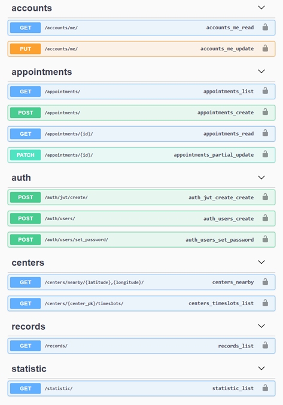
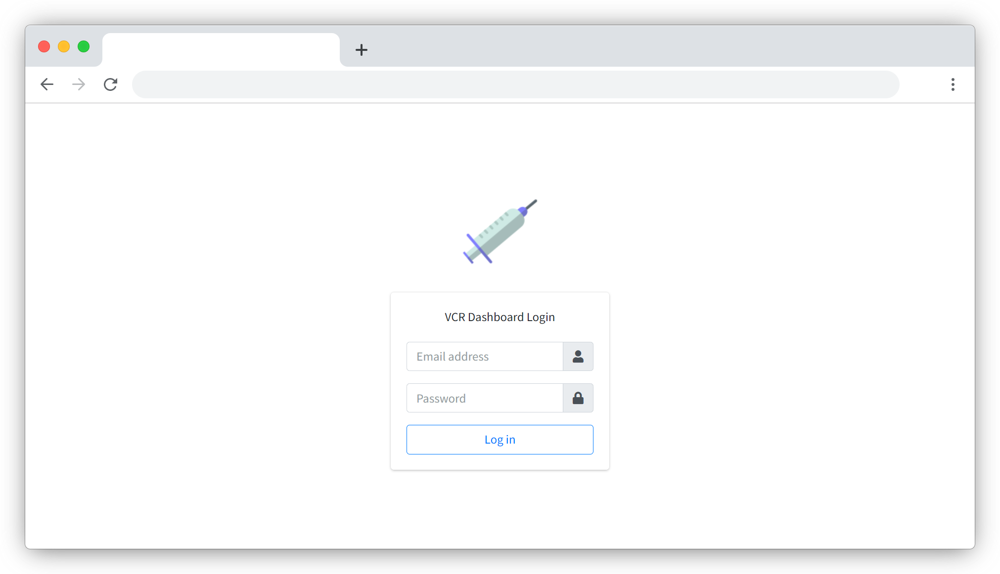
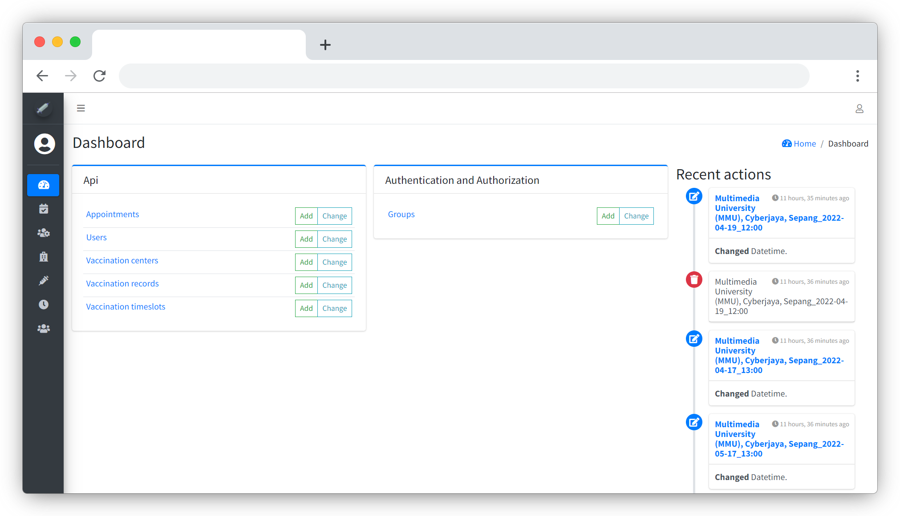
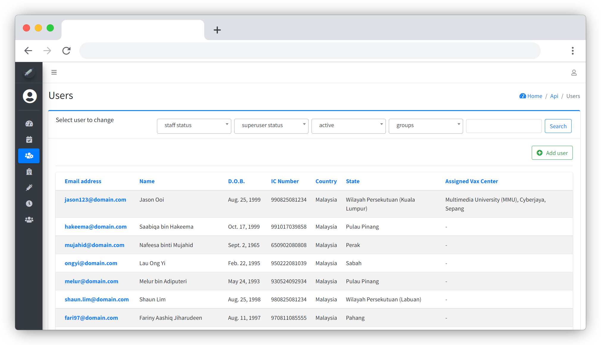
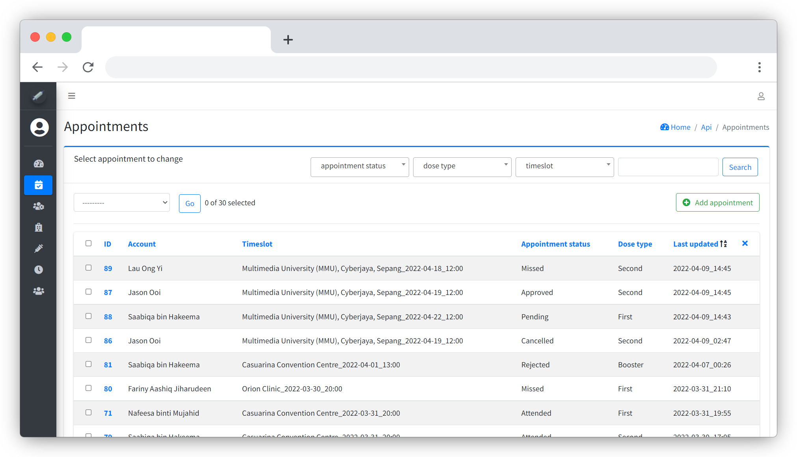
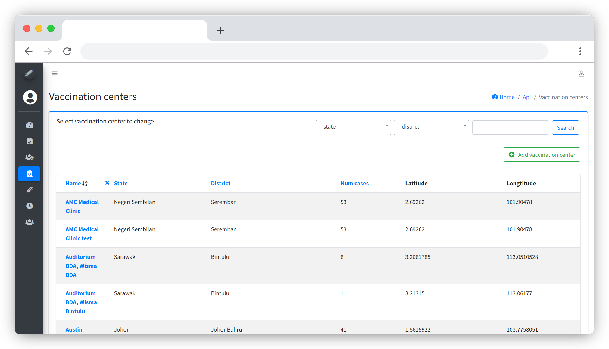
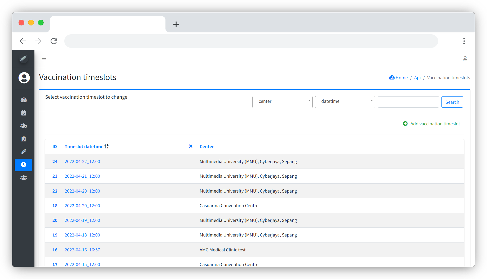
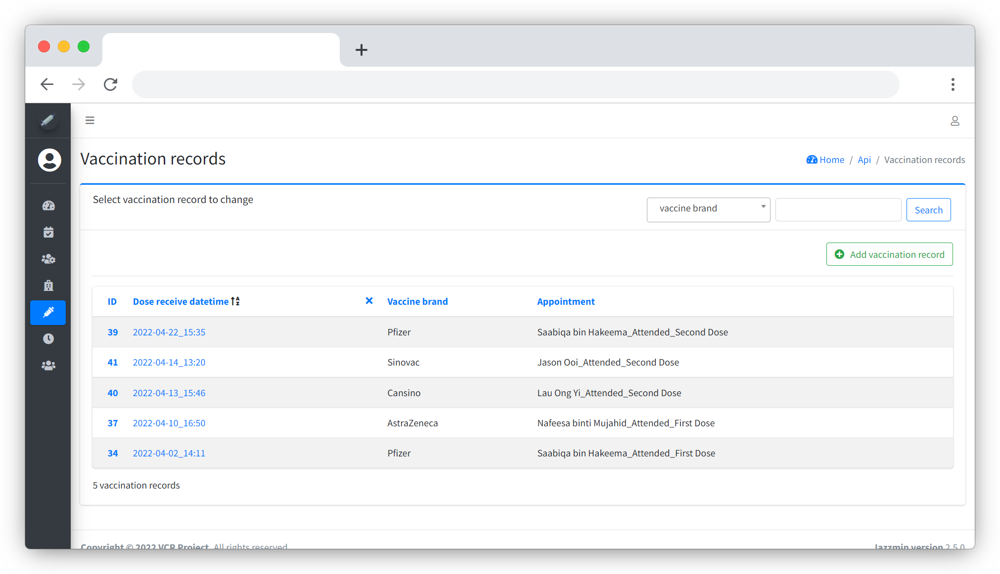

## VCR Backend

The backend of the VCR application, which includes the API services and a dashboard management UI.

## Technologies Used

- Django Framework with GeoDjango enabled
- PostgreSQL with PostGIS support

## Development Requirement

- Python 3
- Postgres database for storing OpenStreetMap data and VCR app data

## Database Setup

### OpenStreetMap routable database

1. Download OSM data from [Geofabrik](https://download.geofabrik.de/)
2. Convert OSM’s XML-Data file to a routable database file (.sql) with [osm2po](https://osm2po.de/)
3. Create a Postgres database with PostGIS and pgrouting extensions enabled
4. Import the OSM sql file to the database with any SQL dump tool

### VCR application database

Create another Postgres database for storing application data

## Development Guide

1. Clone this repo

```
git clone https://github.com/jason-dev1/vcr-backend.git
```

2. Create and activate virtual environment

```
cd vcr-backend
pipenv shell
```

3. Install dependencies

```
pipenv install
```

4. Initialization (Update database)

```
python manage.py makemigrations
python manage.py migrate
python manage.py init_groups
python manage.py init_ppv
python manage.py exec_jobs
```

5. Run the project

```
python manage.py runserver
```

## API Endpoints



## Dashboard UI Screenshots

Created with Django Admin feature

### Login Page



### Dashboard Page



### Users Page



### Appointments Page



### Centers Page



### Timeslots Page



### Records Page


